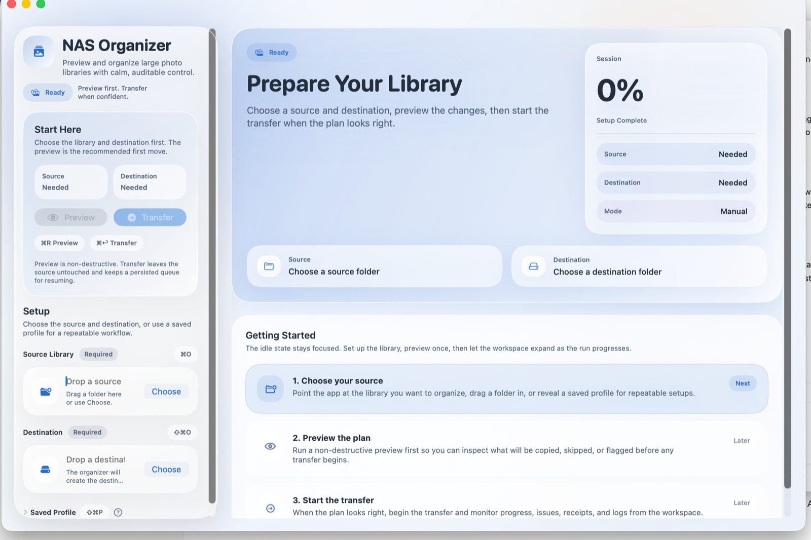
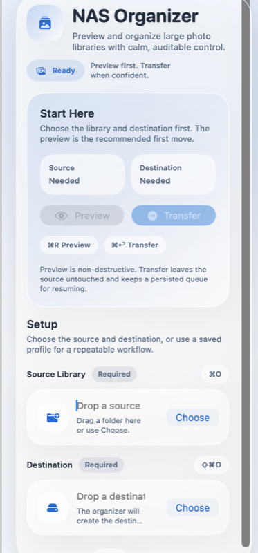

# Chronoframe

A high-safety photo and video organizer for large local or NAS-backed libraries.

The project has two front ends over the same Python engine:

- A Rich-powered CLI for scanning, previewing, resuming, and executing large runs.
- A native macOS SwiftUI app that launches the backend in JSON mode and presents live progress, summaries, and post-run actions.

The organizer is designed for very large libraries where correctness matters more than cleverness. It never mutates the source, stages every copy atomically, persists its copy queue in SQLite, and records what happened in machine-readable artifacts.

## Screenshots

| Overview | Setup Detail |
| :--- | :--- |
|  |  |

## What The Project Does

Given a source library and a destination root, the organizer:

- discovers supported media files recursively
- hashes the source payload and indexes the destination
- skips files already present in the destination
- routes internal source duplicates into `Duplicate/...`
- classifies files by date using EXIF, filename patterns, Spotlight metadata, or `mtime`
- plans date-based destinations under `YYYY/MM/DD/` or `Unknown_Date/`
- writes the copy plan to SQLite before starting transfers
- copies atomically with retry logic for transient failures
- optionally verifies each completed copy by re-hashing the destination

Typical destination layout:

```text
Organized_Photos/
  2024/
    06/
      15/
        2024-06-15_001.jpg
  Unknown_Date/
    Unknown_001.mov
  Duplicate/
    2024/
      06/
        15/
          2024-06-15_001.jpg
```

## Current Highlights

- Full-file BLAKE2b hashing for collision-resistant identity and dedupe decisions.
- Atomic copies through `*.tmp` staging plus `fsync()` before rename.
- SQLite WAL-backed cache and resume queue stored in the destination root.
- Fast resume behavior: interrupted runs can continue from persisted `PENDING` jobs.
- Dry-run planning to CSV before any transfers happen.
- Audit receipts to JSON after execution.
- Collision-safe writes using `_collision_N` suffixes instead of overwrite.
- Verification mode that removes failed copies and marks them as failed instead of trusting them.
- Retry logic that fails fast for permanent path problems such as missing source files.
- Native macOS UI with drag-and-drop setup, command-menu shortcuts, filtered activity views, stronger completion states, and live phase progress, throughput, ETA, and issue counts.

## Safety And Correctness Guarantees

The current code intentionally enforces these rules:

- The source library is never modified or deleted.
- Files already present in the destination are skipped by hash, not by filename.
- Distinct files are identified by a streamed full-file hash, not a partial head/tail sample.
- Every copy is written to a temporary file first, then renamed into place only after the data is flushed.
- Existing destination files are never overwritten. Name collisions are resolved by appending `_collision_N`.
- If `--verify` is enabled and a copy does not match the expected hash, the bad destination copy is removed, the job is marked `FAILED`, and the failed result is not added to the destination cache.
- Audit receipts record the actual destination path that was written, including collision-renamed paths.
- Brand-new destination roots are created automatically before cache or log files are opened.
- Stale queue entries and other permanent path failures fail immediately instead of burning through retry backoff.

## Reliability Model

### Resume Queue

The destination root contains `.organize_cache.db`, which holds:

- `FileCache`: cached source or destination hashes plus `size` and `mtime`
- `CopyJobs`: persisted copy plan with `PENDING`, `COPIED`, or `FAILED` state

The queue is written before transfers begin, so an interrupted run can be resumed without rebuilding the plan from scratch.

### Atomic Copy Path

`safe_copy_atomic()` in [`chronoframe/io.py`](chronoframe/io.py) performs the write path:

1. Ensure the destination directory exists.
2. Check available disk space with a 10 MB safety buffer.
3. Choose a collision-safe final path if needed.
4. Copy to `final_path.tmp`.
5. `fsync()` the temporary file.
6. Rename the temp file into place.

### Retry Policy

The retry policy is intentionally selective:

- transient `OSError`s are retried with exponential backoff
- permanent local errors are not retried

Currently non-retryable error classes include:

- `ENOSPC`
- `ENOENT`
- `ENOTDIR`
- `EISDIR`
- `EINVAL`

With `tenacity` configured as `reraise=True`, permanent failures surface as the original `OSError` instead of being wrapped in a `RetryError`.

### Failure Abort Thresholds

The engine protects against flapping storage or network conditions with two thresholds:

- `MAX_CONSECUTIVE_FAILURES = 5`
- `MAX_TOTAL_FAILURES = 20`

If either threshold is exceeded during execution, the run aborts early with a clear message instead of churning through a doomed queue.

## Date Extraction Order

Date extraction is intentionally layered and degrades gracefully:

1. EXIF via `exifread`
2. Filename parsing for common camera naming conventions
3. macOS Spotlight metadata via `mdls`
4. Filesystem modified time

If no reliable date can be determined, the file is routed into `Unknown_Date/`.

## CLI And App Flow

The backend is implemented in [`chronoframe/core.py`](chronoframe/core.py) and orchestrates these phases:

1. Startup
2. Discovery
3. Source hashing
4. Destination indexing
5. Classification
6. Copy plan generation
7. Dry run or execution

When launched with `--json`, the backend emits one JSON object per line. The SwiftUI app consumes that stream and maps backend phases into its UI.

### JSON Event Types

The current protocol includes:

- `startup`
- `task_start`
- `task_progress`
- `task_complete`
- `copy_plan_ready`
- `info`
- `warning`
- `error`
- `prompt`
- `complete`

Important payload fields currently used by the UI include:

- `found`
- `count`
- `already_in_dst`
- `dups`
- `errors`
- `copied`
- `failed`
- `bytes_copied`
- `bytes_total`
- `dest`
- `report`
- `status`

## macOS UI

The macOS app lives under [`ui/`](ui/).

Current UI behavior:

- native SwiftUI shell over the Python backend
- source and destination folder selection
- drag-and-drop folder setup for source and destination
- optional saved-profile flow
- preview and transfer actions
- state-aware left rail that emphasizes setup before a run and live controls during a run
- hero status surface with progress, throughput, and ETA
- run metrics for discovered, planned, already organized, duplicates, issues, and completed copies
- phase visualization for Discover, Hash Source, Index Destination, Classify, and Transfer
- segmented activity area with summary and filterable console modes
- keyboard shortcuts and app command menus for common actions
- a stronger completion experience with destination, report, and log follow-up actions
- checked-in custom app icon assets and cleaner app bundle metadata

Core UI files:

- [`ui/Sources/ContentView.swift`](ui/Sources/ContentView.swift)
- [`ui/Sources/BackendRunner.swift`](ui/Sources/BackendRunner.swift)
- [`ui/Sources/ChronoframeApp.swift`](ui/Sources/ChronoframeApp.swift)
- [`ui/Tools/IconGenerator.swift`](ui/Tools/IconGenerator.swift)

The macOS app now builds from the checked-in [`ui/Chronoframe.xcodeproj`](ui/Chronoframe.xcodeproj). [`ui/build.sh`](ui/build.sh) is the thin local-development wrapper around `xcodebuild`, while [`ui/archive.sh`](ui/archive.sh) produces a Release archive from the same project. The source artwork still lives in [`ui/Resources/AppIcon.iconset`](ui/Resources/AppIcon.iconset), and the checked-in bundle icon is [`ui/Resources/AppIcon.icns`](ui/Resources/AppIcon.icns).

Both packaging scripts run [`ui/Packaging/validate_app_bundle.py`](ui/Packaging/validate_app_bundle.py) after signing so bundle-structure regressions fail fast. Local `build.sh` output is ad hoc signed for sealed-resource validation. For distribution archives, set `CHRONOFRAME_CODESIGN_IDENTITY` to a Developer ID Application identity before running `archive.sh`; the Release archive will then be checked for Developer ID signing, hardened runtime, and timestamped signatures using [`ui/Packaging/Chronoframe.entitlements`](ui/Packaging/Chronoframe.entitlements).

## Installation

Python dependencies are listed in [`requirements.txt`](requirements.txt):

- `exifread`
- `tenacity`
- `rich`
- `pyyaml`

The bootstrap wrapper [`chronoframe.py`](chronoframe.py) checks for these packages and offers to install them if they are missing.

### CLI Usage

```bash
# explicit source and destination
python3 chronoframe.py --source /Volumes/photo/Incoming --dest /Volumes/home/Organized_Photos

# use a named profile from profiles.yaml
python3 chronoframe.py --profile mobile_backup

# plan only, write a CSV, do not copy
python3 chronoframe.py --source /Volumes/photo/Incoming --dest /Volumes/home/Organized_Photos --dry-run

# skip prompts for unattended use
python3 chronoframe.py --source /Volumes/photo/Incoming --dest /Volumes/home/Organized_Photos -y

# verify every completed copy by re-hashing the destination
python3 chronoframe.py --source /Volumes/photo/Incoming --dest /Volumes/home/Organized_Photos --verify

# reuse cached destination index for repeated previews
python3 chronoframe.py --source /Volumes/photo/Incoming --dest /Volumes/home/Organized_Photos --fast-dest --dry-run
```

### CLI Flags

| Flag | Meaning |
| :--- | :--- |
| `--source PATH` | Source directory to scan |
| `--dest PATH` | Destination root for organized output |
| `--profile NAME` | Load source and destination from `profiles.yaml` |
| `--dry-run` | Build the copy plan and write a CSV without copying |
| `--verify` | Re-hash the destination after each copy |
| `--rebuild-cache` | Force a full rebuild of the destination cache |
| `--fast-dest` | Load destination index from cache instead of scanning the destination |
| `--workers N` | Hashing worker count, default `8` |
| `--json` | Emit JSON progress events for the GUI |
| `-y`, `--yes` | Auto-confirm prompts |

### macOS App

**Download the latest release:**

1. Go to the [Releases page](https://github.com/Nishith/NAS-Photo-Organizer/releases) and download `Chronoframe.vX.Y.Z.zip`.
2. Unzip and drag **Chronoframe.app** to `/Applications`.
3. If the release is signed but not yet notarized, macOS Gatekeeper may still block the first launch. Right-click (or Control-click) the app, choose **Open**, then confirm in the dialog.

**Build from source:**

```bash
cd ui
./build.sh
open "build/Chronoframe.app"
```

To produce a Release archive and zip from the Xcode project:

```bash
cd ui
./archive.sh
```

To validate an existing bundle directly:

```bash
python3 ui/Packaging/validate_app_bundle.py ui/build/Chronoframe.app
```

The app launches the Python backend using `python3 chronoframe.py --json --yes ...`.

Useful keyboard shortcuts in the current app:

- `Cmd+O` chooses the source folder
- `Shift+Cmd+O` chooses the destination folder
- `Shift+Cmd+P` reveals the saved-profile field
- `Cmd+R` starts a preview
- `Cmd+Return` starts a transfer
- `Cmd+L` toggles the activity pane

## Configuration Profiles

Profiles live in `profiles.yaml` at the project root.

Example:

```yaml
default:
  source: "/Volumes/MyDrive/Incoming"
  dest: "/Volumes/MyDrive/Organized_Photos"

mobile_backup:
  source: "/Volumes/MyDrive/Phone_Imports"
  dest: "/Volumes/MyDrive/Organized_Photos"
```

Resolution behavior:

- `--profile NAME` uses that named profile
- otherwise, if `--source` or `--dest` is missing, the tool falls back to the `default` profile if it exists

`profiles.yaml` is intentionally ignored by Git in this repository because it is expected to contain machine-local paths.

## Generated Files

The organizer writes run state and reports into the destination root:

| File | Purpose |
| :--- | :--- |
| `.organize_cache.db` | SQLite cache and persisted copy queue |
| `.organize_log.txt` | Plain-text run log |
| `.organize_logs/dry_run_report_*.csv` | Dry-run plan export |
| `.organize_logs/audit_receipt_*.json` | Executed transfer receipt |

The app build output under `ui/build/` is also ignored by Git.

## Repository Layout

```text
Chronoframe/
  docs/
    screenshots/
      ui-overview.png
      ui-setup-detail.png
  chronoframe.py
  requirements.txt
  README.md
  chronoframe/
    __init__.py
    __main__.py
    core.py
    database.py
    io.py
    metadata.py
  ui/
    Sources/
      BackendRunner.swift
      ContentView.swift
      ChronoframeApp.swift
    Tools/
      IconGenerator.swift
    build.sh
  test_chronoframe.py
```

## Testing

The current repository test suite contains Python backend tests in [`test_chronoframe.py`](test_chronoframe.py), macOS packaging smoke tests in [`test_ui_build.py`](test_ui_build.py), and packaging validator tests in [`test_ui_packaging.py`](test_ui_packaging.py).

Run the suite with:

```bash
python3 -m unittest test_chronoframe.py -v
```

Representative coverage areas include:

- hashing behavior and cache reuse
- atomic copy and collision handling
- retry classification and disk-space failure behavior
- destination indexing and `--fast-dest`
- classification and date extraction fallback
- copy execution, verification failure handling, and abort thresholds
- dry-run reports and audit receipts
- profile loading and CLI parsing

## Notes And Tradeoffs

- The destination cache is a performance feature. Use `--rebuild-cache` when you explicitly want a full refresh.
- `--fast-dest` is best for repeated previews against a stable destination and should not be treated as a substitute for a real rebuild forever.
- The GUI is macOS-specific, but the backend itself is plain Python.
- Spotlight-based date extraction depends on macOS tooling.

## Current State Summary

As of the current codebase, this project is:

- a resumable Python organizer with strong correctness-oriented transfer logic
- a macOS SwiftUI front end with keyboard-driven commands, drag-and-drop setup, and a more product-like desktop experience
- safe to preview repeatedly
- designed to survive interruptions and partial failures
- optimized for large libraries where both speed and auditability matter
